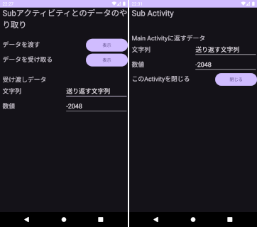

## サブ画面アクティビティとのデータ授受方法のメモ<!-- omit in toc -->

---
[Home](https://oasis3855.github.io/webpage/) > [Software](https://oasis3855.github.io/webpage/software/index.html) > [ソフトウエア開発・PC管理のメモ帳](https://oasis3855.github.io/webpage/software/software_server_memo.html) > [Workspace_Android](../README.md)  > ***Activity_Subscreen*** (this page)

<br />
<br />

Last Updated : 2025/01/03

- [概要](#概要)
- [ソースコード](#ソースコード)
  - [メイン・アクティビティと共通部分](#メインアクティビティと共通部分)
  - [値を受け取るサブ・アクティビティ](#値を受け取るサブアクティビティ)
  - [値を返すサブ・アクティビティ](#値を返すサブアクティビティ)
- [メイン・アクティビティからサブ・アクティビティに値を渡す方法](#メインアクティビティからサブアクティビティに値を渡す方法)
  - [引き渡し値の処理と、サブ・アクティビティの起動](#引き渡し値の処理とサブアクティビティの起動)
  - [サブ・アクティビティで値を受け取る](#サブアクティビティで値を受け取る)
- [サブ・アクティビティからメイン・アクティビティに値を返す方法](#サブアクティビティからメインアクティビティに値を返す方法)
  - [メイン・アクティビティでの準備](#メインアクティビティでの準備)
  - [サブ・アクティビティで送り返す値を用意し、アクティビティを終了する](#サブアクティビティで送り返す値を用意しアクティビティを終了する)
  - [メイン・アクティビティで値を受け取る](#メインアクティビティで値を受け取る)

<br />
<br />

## 概要

メイン・アクティビティからサブ・アクティビティに値を渡す方法と、サブ・アクティビティからメイン・アクティビティに値を返す方法。



<br />
<br />

## ソースコード

### メイン・アクティビティと共通部分

- [Javaソースコード : MainActivity.java](./app/src/main/java/com/example/activitysubscreentest02/MainActivity.java)
- [レイアウトXML : activity_main.xml](./app/src/main/res/layout/activity_main.xml)

- [AndroidManifest.xml](./app/src/main/AndroidManifest.xml)

### 値を受け取るサブ・アクティビティ

- [Javaソースコード : SubActivityPutdata.java](./app/src/main/java/com/example/activitysubscreentest02/SubActivityPutdata.java)
- [レイアウトXML : activity_sub_putdata.xml](./app/src/main/res/layout/activity_sub_putdata.xml)

### 値を返すサブ・アクティビティ

- [Javaソースコード : SubActivityReturndata.java](./app/src/main/java/com/example/activitysubscreentest02/SubActivityReturndata.java)
- [レイアウトXML : activity_sub_returndata.xml](./app/src/main/res/layout/activity_sub_returndata.xml)

<br />
<br />

## メイン・アクティビティからサブ・アクティビティに値を渡す方法

startActivityForResult(intent, REQUEST_CODE) を使う方法は非推奨となったため、Activity Result APIを利用する。

### 引き渡し値の処理と、サブ・アクティビティの起動

変数の受取先アクティビティ（＝サブ・アクティビティ）を指定したintentを作成し、そのintentをstartActivityメソッドを用いて起動する。

この例では、2つの変数（KEY_STR01とKEY_INT01）が引き渡される。

```java
// Subアクティビティにデータを渡すボタンが押されたときの処理
Intent intent = new Intent(this, SubActivityPutdata.class);

// 受け渡しデータをeditTextから読み込み、intentに送る（書き込む）
EditText textStr01 = findViewById(R.id.editTextString01);
intent.putExtra("KEY_STR01", textStr01.getText().toString());
EditText textInt01 = findViewById(R.id.editTextInt01);
intent.putExtra("KEY_INT01", Integer.parseInt(textInt01.getText().toString()));

// Subアクティビティを起動
startActivity(intent);
```

<br />
<br />

### サブ・アクティビティで値を受け取る

intentより値を読み込む。この例では、2つの変数（KEY_STR01とKEY_INT01）を読み込んでいる。

```java
// intentから受け渡しデータを読み込んで、editTextに表示する
Intent intent = getIntent();
EditText textStr01 = findViewById(R.id.editTextString01);
textStr01.setText(intent.getStringExtra("KEY_STR01"));
EditText textInt01 = findViewById(R.id.editTextInt01);
textInt01.setText(Integer.toString(intent.getIntExtra("KEY_INT01", -1)));
```

<br />
<br />

## サブ・アクティビティからメイン・アクティビティに値を返す方法

### メイン・アクティビティでの準備

サブ・アクティビティの起動前にActivityResultLauncherインスタンスを用意して、**何らかの**アクティビティからの終了メッセージを待ち受ける。

```java
public class MainActivity extends AppCompatActivity implements View.OnClickListener {

    private ActivityResultLauncher<Intent> activityResultLauncher;

    @Override
    protected void onCreate(Bundle savedInstanceState) {

//〜 途中省略 〜

        // Activity Result API を利用して Subアクティビティを起動するための準備
        activityResultLauncher = registerForActivityResult(
                new ActivityResultContracts.StartActivityForResult(), this::handleActivityResult
        );
    }

    // *****
    // Activity Result API で、起動したSubアクティビティからの戻り値を受け取るためのメソッド
    private void handleActivityResult(ActivityResult result) {
        if (result.getResultCode() == RESULT_OK && result.getData() != null) {

        //〜 ここに値の受取処理を書く 〜

        }
    }
}
```

<br />
<br />

### サブ・アクティビティで送り返す値を用意し、アクティビティを終了する

intentに値を格納し

```java
// 受け渡しデータをeditTextから読み込み、intentに送る（書き込む）
Intent intent = new Intent(this, MainActivity.class);
EditText textStr01 = findViewById(R.id.editTextString01);
intent.putExtra("KEY_STR01", textStr01.getText().toString());
EditText textInt01 = findViewById(R.id.editTextInt01);
intent.putExtra("KEY_INT01", Integer.parseInt(textInt01.getText().toString()));
```

アクティビティを終了する。

なお、受け取り側（＝メイン・アクティビティ）でリザルトコードをチェックしているため、これを手動で設定している。

```java
// result code は手動で設定する必要がある（この処理をしないと、RESULT_CANCEL が返る
setResult(Activity.RESULT_OK, intent);
// このActivityを閉じる（呼び出し元のActivity画面に戻る）
this.finish();
```

<br />
<br />

### メイン・アクティビティで値を受け取る

intentから値を読み出す

```java
// *****
// Activity Result API で、起動したSubアクティビティからの戻り値を受け取るためのメソッド
private void handleActivityResult(ActivityResult result) {
    if (result.getResultCode() == RESULT_OK && result.getData() != null) {
        // Subアクティビティでデータを格納したintentを開く
        Intent intent = result.getData();

        // Subアクティビティから受け取ったデータをEditTextに表示する
        EditText textStr01 = findViewById(R.id.editTextString01);
        textStr01.setText(intent.getStringExtra("KEY_STR01"));
        EditText textInt01 = findViewById(R.id.editTextInt01);
        textInt01.setText(Integer.toString(intent.getIntExtra("KEY_INT01", 0)));
    }
}
```

