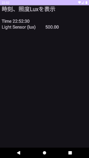
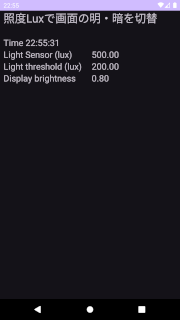
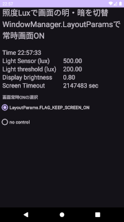
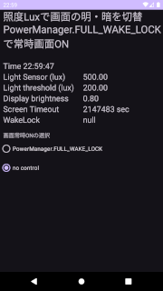
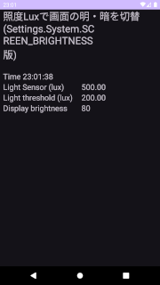

## 画面の明るさ設定方法、スリープ抑止の設定方法のメモ<!-- omit in toc -->

---
[Home](https://oasis3855.github.io/webpage/) > [Software](https://oasis3855.github.io/webpage/software/index.html) > [ソフトウエア開発・PC管理のメモ帳](https://oasis3855.github.io/webpage/software/software_server_memo.html) > [Workspace_Android](../README.md)  > ***Brightness_Sleep*** (this page)

<br />
<br />

Last Updated : 2024/12/12

目次

- [概要](#概要)
- [DisplaySleepTest01](#displaysleeptest01)
  - [照度センサーから値を読み取る](#照度センサーから値を読み取る)
- [DisplaySleepTest02](#displaysleeptest02)
  - [画面明るさの設定（当該アプリのみ）](#画面明るさの設定当該アプリのみ)
- [DisplaySleepTest03](#displaysleeptest03)
  - [画面スリープ抑止（当該アプリのみ）](#画面スリープ抑止当該アプリのみ)
- [DisplaySleepTest04](#displaysleeptest04)
  - [画面スリープ抑止（システム全体）](#画面スリープ抑止システム全体)
- [DisplaySleepTest05](#displaysleeptest05)
  - [画面明るさの設定（システム全体）](#画面明るさの設定システム全体)
  - [権限取得とIntent](#権限取得とintent)

## 概要

画面の明るさ設定、画面スリープ抑止の方法をアプリ単体・システム全体で設定する方法のメモ

<br />
<br />

## DisplaySleepTest01

画面に時計を表示するだけの基本プログラム。これをベースにして、画面明るさ設定やスリープ抑止の機能を追加していく。

- 主な機能
  - スレッドを用いて、1秒毎に画面情報表示＆ログ出力（現在時刻、照度センサー値 ほか）

- 主なソースコードを直接参照する
  - [MainActivity.java](./DisplaySleepTest01/app/src/main/java/com/example/displaysleeptest01/MainActivity.java)
  - [activity_main.xml](./DisplaySleepTest01/app/src/main/res/layout/activity_main.xml)



### 照度センサーから値を読み取る

```java
public class MainActivity extends AppCompatActivity implements SensorEventListener {
    private SensorManager sensorManager;
    private float lightSensorValue;

    @Override
    protected void onCreate(Bundle savedInstanceState) {
        sensorManager = (SensorManager) getSystemService(Context.SENSOR_SERVICE);
        Sensor lightSensor = sensorManager.getDefaultSensor(Sensor.TYPE_LIGHT);
        sensorManager.registerListener(this, lightSensor, SensorManager.SENSOR_DELAY_UI);

    }

    @Override
    protected void onDestroy() {
        super.onDestroy();
        if (sensorManager != null) {
            sensorManager.unregisterListener(this);
        }
    }

    // センサー・イベント・リスナーでオーバーライドされる関数
    //（class MainActivity に implements SensorEventListener を記述すると、自動的に作成される）
    @Override
    public void onSensorChanged(SensorEvent sensorEvent) {
        // 照度センサー値の場合は、メンバ変数lightSensorValueにコピーする
        if (sensorEvent.sensor.getType() == Sensor.TYPE_LIGHT) {
            lightSensorValue = sensorEvent.values[0];
        }
    }
}
```

<br />
<br />

## DisplaySleepTest02

- 主な機能
  - スレッドを用いて、1秒毎に画面情報表示＆ログ出力（現在時刻、照度センサー値 ほか）
  - 照度センサー値により、画面明るさを2段階に切り替え（このアプリのみ : WindowManager.LayoutParams.screenBrightness）

- 主なソースコードを直接参照する
  - [MainActivity.java](./DisplaySleepTest02/app/src/main/java/com/example/displaysleeptest02/MainActivity.java)
  - [activity_main.xml](./DisplaySleepTest02/app/src/main/res/layout/activity_main.xml)



### 画面明るさの設定（当該アプリのみ）

```WindowManager.LayoutParams.screenBrightness```に0.0〜1.0の値を設定する。次の例は明るさ0.5に設定する例

```java
WindowManager.LayoutParams lp = getWindow().getAttributes();
if (lp.screenBrightness != 0.5f) {
  lp.screenBrightness = 0.5f;
  getWindow().setAttributes(lp);
}
```

<br />
<br />

## DisplaySleepTest03

- 主な機能
  - スレッドを用いて、1秒毎に画面情報表示＆ログ出力（現在時刻、照度センサー値 ほか）
  - 照度センサー値により、画面明るさを2段階に切り替え（このアプリのみ : WindowManager.LayoutParams.screenBrightness）
   - 画面スリープ抑止（このアプリのみ : WindowManager.LayoutParams.FLAG_KEEP_SCREEN_ON）

- 主なソースコードを直接参照する
  - [MainActivity.java](./DisplaySleepTest03/app/src/main/java/com/example/displaysleeptest03/MainActivity.java)
  - [activity_main.xml](./DisplaySleepTest03/app/src/main/res/layout/activity_main.xml)



### 画面スリープ抑止（当該アプリのみ）

```java
if ((getWindow().getAttributes().flags & WindowManager.LayoutParams.FLAG_KEEP_SCREEN_ON) == 0) {
    getWindow().addFlags(WindowManager.LayoutParams.FLAG_KEEP_SCREEN_ON);
}
```

<br />
<br />

## DisplaySleepTest04

- 主な機能
  - スレッドを用いて、1秒毎に画面情報表示＆ログ出力（現在時刻、照度センサー値 ほか）
   - 照度センサー値により、画面明るさを2段階に切り替え（このアプリのみ : WindowManager.LayoutParams.screenBrightness）
   - 画面スリープ抑止（システム全体 : PowerManager.FULL_WAKE_LOCK）
  - ※ 非推奨機能（PowerManager.FULL_WAKE_LOCK）の利用

- 主なソースコードを直接参照する
  - [MainActivity.java](./DisplaySleepTest04/app/src/main/java/com/example/displaysleeptest04/MainActivity.java)
  - [activity_main.xml](./DisplaySleepTest04/app/src/main/res/layout/activity_main.xml)



### 画面スリープ抑止（システム全体）

```PowerManager.FULL_WAKE_LOCK```を用いたシステム全体のスリープ抑止は、API 17 (Android 4.2)以降で非推奨（deprecated）となっている。

```java
PowerManager powerManager = (PowerManager) getSystemService(Context.POWER_SERVICE);
wakeLock = powerManager.newWakeLock(PowerManager.FULL_WAKE_LOCK | PowerManager.ACQUIRE_CAUSES_WAKEUP | PowerManager.ON_AFTER_RELEASE, "MyApp::MyWakelockTag");
if (!wakeLock.isHeld()) {
  wakeLock.acquire();
}
```

次のような権限設定を```app/src/main/AndroidManifest.xml```に記述する。

```xml
<uses-permission android:name="android.permission.WAKE_LOCK" />
```

<br />
<br />

## DisplaySleepTest05

- 主な機能
  - スレッドを用いて、1秒毎に画面情報表示＆ログ出力（現在時刻、照度センサー値 ほか）
  - 照度センサー値により、画面明るさを2段階に切り替え（システム全体 : Settings.System.SCREEN_BRIGHTNESS）
  - システム全体の画面明るさ設定を得るための Intent の実装

- 主なソースコードを直接参照する
  - [MainActivity.java](./DisplaySleepTest05/app/src/main/java/com/example/displaysleeptest05/MainActivity.java)
  - [activity_main.xml](./DisplaySleepTest05/app/src/main/res/layout/activity_main.xml)
  - [AndroidManifest.xml](./DisplaySleepTest05/app/src/main/AndroidManifest.xml)



### 画面明るさの設定（システム全体）

```Settings.System.SCREEN_BRIGHTNESS```に0〜100の値を書き込む。次の例は明るさ50にする場合の例

```java
if (Settings.System.canWrite(this)) {
    Settings.System.putInt(getContentResolver(), Settings.System.SCREEN_BRIGHTNESS, 50);
} 
```

### 権限取得とIntent

次のような権限設定を```app/src/main/AndroidManifest.xml```に記述するとともに、API 23以降に対してIntentを実装する。

```xml
<uses-permission android:name="android.permission.WRITE_SETTINGS" />
```

```java
Intent intent = new Intent(Settings.ACTION_MANAGE_WRITE_SETTINGS);
intent.setData(Uri.parse("package:" + getPackageName()));
startActivity(intent);
```
