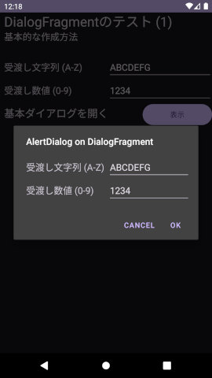

## DialogFragmentでのダイアログ作成方法メモ<!-- omit in toc -->

---
[Home](https://oasis3855.github.io/webpage/) > [Software](https://oasis3855.github.io/webpage/software/index.html) > [ソフトウエア開発・PC管理のメモ帳](https://oasis3855.github.io/webpage/software/software_server_memo.html) > [Workspace_Android](../README.md)  > ***DialogFragment*** (this page)

<br />
<br />

Last Updated : 2025/01/07

- [概要](#概要)
- [ソースコード](#ソースコード)
  - [DialogFragmentTest01](#dialogfragmenttest01)
    - [ソースコード](#ソースコード-1)
  - [DialogFragmentTest02](#dialogfragmenttest02)
    - [ソースコード](#ソースコード-2)
- [プログラムの流れ](#プログラムの流れ)
  - [ダイアログの表示（値の受け渡し処理を含まない）](#ダイアログの表示値の受け渡し処理を含まない)
  - [DialogFragmentに値を引き渡す](#dialogfragmentに値を引き渡す)
  - [DialogFragmentで押されたボタン（OKやCancel）を呼び出し側のMainActivityに通知する](#dialogfragmentで押されたボタンokやcancelを呼び出し側のmainactivityに通知する)
  - [MainActivityに送る通知と共に、値を返す](#mainactivityに送る通知と共に値を返す)

<br />
<br />


## 概要

DialogFragmentを用いてダイアログを作成表示する方法のメモ。呼び出し元のMainActivityと、呼び出される側のDialogFragmentの間で、**Bundleを用いて値を受け渡しする方法**がこの記事のメイントピックとなる。

<br />
<br />

## ソースコード

### DialogFragmentTest01

ViewにEditText等の入力インターフェース（ヴィジェット）と、OK/Cancelボタンを配置するカスタムダイアログを作成する方法。


#### ソースコード

MainActivity
- [MainActivity.java](./DialogFragmentTest01/app/src/main/java/com/example/dialogfragmenttest01/MainActivity.java)
- [activity_main.xml](./DialogFragmentTest01/app/src/main/res/layout/activity_main.xml)

DialogFragment
- [FragmentBasicSample.java](./DialogFragmentTest01/app/src/main/java/com/example/dialogfragmenttest01/FragmentBasicSample.java)
- [fragment_edittext.xml](./DialogFragmentTest01/app/src/main/res/layout/fragment_edittext.xml)

<br />
<br />

### DialogFragmentTest02

AlertDialogを用いる少し簡便な方法。OK/CancelボタンはAlertDialogにビルトインされているものが利用可能。



#### ソースコード

MainActivity
- [MainActivity.java](./DialogFragmentTest02/app/src/main/java/com/example/dialogfragmenttest02/MainActivity.java)
- [activity_main.xml](./DialogFragmentTest02/app/src/main/res/layout/activity_main.xml)

DialogFragment
- [FragmentBasicSample.java](./DialogFragmentTest02/app/src/main/java/com/example/dialogfragmenttest02/FragmentBasicSample.java)
- [fragment_edittext.xml](./DialogFragmentTest02/app/src/main/res/layout/fragment_edittext.xml)

<br />
<br />

## プログラムの流れ

### ダイアログの表示（値の受け渡し処理を含まない）

基本的なDialogFragmentでのダイアログ表示の方法は次の通り。

呼び出し側（MainActivity）でダイアログを起動する

```java
DialogFragment dlg = new FragmentBasicSample();
dlg.show(getSupportFragmentManager(), "FragmentBasicSample");
```

呼び出される側（DialogFragment）でレイアウトリソース（xml）からViewを構築する。

Okボタンを押すと、dismiss() を呼び出してダイアログを閉じる。なお、下の例のようにカスタムダイアログをViewで構築する場合は onCreateView() でダイアログを構築し、AlertDialogを用いてダイアログを構築する場合は onCreateDialog() で処理を行う。

```java
public class FragmentBasicSample extends DialogFragment {
    @Override
    public View onCreateView(@NonNull LayoutInflater inflater, @Nullable ViewGroup container, @Nullable Bundle savedInstanceState) {
        // xmlからレイアウトリソースを読み込む
        View view = inflater.inflate(R.layout.fragment_edittext, container);
        // Okボタンを押下したときの処理
        Button buttonOk = view.findViewById(R.id.buttonOk);
        buttonOk.setOnClickListener(new View.OnClickListener() {
            @Override
            public void onClick(View view) {
                // ダイアログを閉じる
                dismiss();
            }
        });
        return view;
    }
}
```

AlertDialogを構築する場合は、onCreateView()ではなく、onCreateDialog() で行う。

```java
public Dialog onCreateDialog(@Nullable Bundle savedInstanceState) {
    AlertDialog.Builder builder = new AlertDialog.Builder(getActivity());
    LayoutInflater inflater = requireActivity().getLayoutInflater();
    View view = inflater.inflate(R.layout.fragment_edittext, null);
    builder.setView(view)
            .setTitle("AlertDialog on DialogFragment")
            .setPositiveButton("OK", new DialogInterface.OnClickListener() {
                @Override
                public void onClick(DialogInterface dialogInterface, int i) {
                    // AlertDialogの場合、dismiss() は不要
                }
            })
    return builder.create();
}
```

<br />
<br />

### DialogFragmentに値を引き渡す

呼び出し側（MainActivity）でダイアログを起動前にBundleに値を書き込んで引き渡す

```java
DialogFragment dlg = new FragmentBasicSample();
// Fragmentにデータ（文字列と数値）を引き渡すBundleの定義
Bundle bundle = new Bundle();
// Bundleに値を書き込む
bundle.putString("KEY_STR", "引き渡したいサンプル文字列");
bundle.putInt("KEY_INT", 1234);
dlg.setArguments(bundle);
// カスタムダイアログFragmentBasicSampleを表示する
dlg.show(getSupportFragmentManager(), "FragmentBasicSample");
```

呼び出される側（DialogFragment）でBundleから値を読み込む

```java
public class FragmentBasicSample extends DialogFragment {
    @Override
    public View onCreateView(@NonNull LayoutInflater inflater, @Nullable ViewGroup container, @Nullable Bundle savedInstanceState) {
        // xmlからレイアウトリソースを読み込む
        View view = inflater.inflate(R.layout.fragment_edittext, container);

        // 呼び出し側（ActivityMain）から変数を受け取る
        EditText editText_Str = view.findViewById(R.id.editText_Str);
        String str = requireArguments().getString("KEY_STR", "値がない場合のデフォルト値");
        Integer num = requireArguments().getInt("KEY_INT");

        // Okボタンを押下したときの処理
        Button buttonOk = view.findViewById(R.id.buttonOk);
        buttonOk.setOnClickListener(new View.OnClickListener() {
            @Override
            public void onClick(View view) {
                // ダイアログを閉じる
                dismiss();
            }
        });
        return view;
    }
}
```

<br />
<br />

### DialogFragmentで押されたボタン（OKやCancel）を呼び出し側のMainActivityに通知する

呼び出される側（DialogFragment）でコールバックのinterfaceを定義する

```java
public class FragmentBasicSample extends DialogFragment {

    // ダイアログで押されたボタンイベントを、呼び出し側に返すinterfaceを定義する
    private NoticeDialogListener noticeDialogListener;

    public interface NoticeDialogListener {
        // 任意の引数を「Bundleに紐づけて」返す場合
        public void onDialogButtonOkClick(DialogFragment dialog);
        public void onDialogButtonCancelClick(DialogFragment dialog);
    }
}
```

そして、dismiss() でダイアログを閉じる前に、定義したinterfaceを通して呼び出し側に通知する。

```java
public class FragmentBasicSample extends DialogFragment {

    @Override
    public View onCreateView(@NonNull LayoutInflater inflater, @Nullable ViewGroup container, @Nullable Bundle savedInstanceState) {
        // xmlからレイアウトリソースを読み込む
        View view = inflater.inflate(R.layout.fragment_edittext, container);
        // Okボタンを押下したときの処理
        Button buttonOk = view.findViewById(R.id.buttonOk);
        buttonOk.setOnClickListener(new View.OnClickListener() {
            @Override
            public void onClick(View view) {
                // 呼び出し側に通知する
                noticeDialogListener.onDialogButtonOkClick(FragmentBasicSample.this);
                // ダイアログを閉じる
                dismiss();
            }
        });
        return view;
    }
}
```

<br />
<br />

### MainActivityに送る通知と共に、値を返す

DialogFragmnentから値を返す処理。interfaceで通知を送るときに、第2引数にBundleを追加している。

なお、コールバックinterfaceメソッドの引数はどのように定義してもよく、下の例ではDialogFragment と Bundle が入っているが、これを「返したい値の列挙」としても構わない。

```java
public class FragmentBasicSample extends DialogFragment {

    // ダイアログで押されたボタンイベントを、呼び出し側に返すinterfaceを定義する
    private NoticeDialogListener noticeDialogListener;

    @Override
    public View onCreateView(@NonNull LayoutInflater inflater, @Nullable ViewGroup container, @Nullable Bundle savedInstanceState) {
        buttonOk.setOnClickListener(new View.OnClickListener() {
            @Override
            public void onClick(View view) {
                Bundle bundle = new Bundle();
                bundle.putString("KEY_STR", "MainActivitytに返す文字列");
                bundle.putInt("KEY_INT", 9876);
                // Bundleを使って変数を返す場合
                noticeDialogListener.onDialogButtonOkClick(FragmentBasicSample.this, bundle);
                // ダイアログを閉じる
                dismiss();
            }
        });
    }
    public interface NoticeDialogListener {
        // 任意の引数を「Bundleに紐づけて」返す場合
        public void onDialogButtonOkClick(DialogFragment dialog, Bundle bundle);
    }
}
```

MainActivityで通知を受け取る処理

```java
@Override
public void onDialogButtonOkClick(DialogFragment dialog, Bundle bundle) {
    String str = bundle.getString("KEY_STR", "値が見つかりません");
}
```

<br />
<br />
