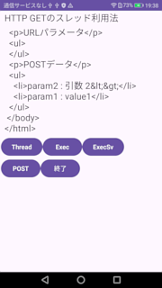
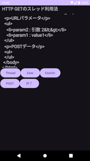
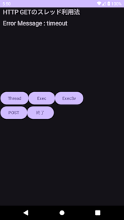
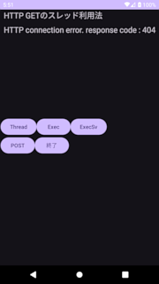
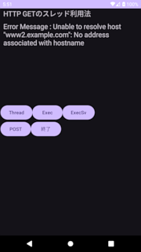

## HTTP GET, HTTP POSTでURLパラメータを受け渡す方法<!-- omit in toc -->

---
[Home](https://oasis3855.github.io/webpage/) > [Software](https://oasis3855.github.io/webpage/software/index.html) > [ソフトウエア開発・PC管理のメモ帳](https://oasis3855.github.io/webpage/software/software_server_memo.html) > [Workspace_Android](../README.md)  > ***NetHttpGet*** (this page)

<br />
<br />

Last Updated : 2025/05/31

- [概要](#概要)
- [ソースコード](#ソースコード)
- [実行時の画面例](#実行時の画面例)
- [プログラミングTips](#プログラミングtips)
  - [HTTP接続でデータを受信する(HTTP GET)](#http接続でデータを受信するhttp-get)
    - [最低限のスケルトン](#最低限のスケルトン)
    - [HTTPのセットアップパラメータの設定やエラー処理を含んだ実用的なプログラム](#httpのセットアップパラメータの設定やエラー処理を含んだ実用的なプログラム)
  - [HTTP接続でデータを送受信する(HTTP POST)](#http接続でデータを送受信するhttp-post)
    - [最低限のスケルトン](#最低限のスケルトン-1)
- [非同期処理](#非同期処理)
  - [Executorを使う](#executorを使う)
  - [ExecutorServiceを使う](#executorserviceを使う)
- [エラートラップ](#エラートラップ)
  - [Threadを使う](#threadを使う)
- [非同期タスク（ExecutorやThread）の中からHandlerを使ってUIを更新する](#非同期タスクexecutorやthreadの中からhandlerを使ってuiを更新する)


<br />
<br />


## 概要

非同期処理を用いてWebサーバに接続を行い、HTTP GETまたはHTTP POSTを用いてURLパラメータを受け渡す方法。

<br />
<br />

## ソースコード

MainActivity
- [MainActivity.java](./app/src/main/java/com/example/nethttpget_test01/MainActivity.java)
- [activity_main.xml](./app/src/main/res/layout/activity_main.xml)

<br />
<br />

## 実行時の画面例




Android 7(ライトテーマ)とAndroid 10（ダークテーマ）の実行画面例

<br />
<br />

## プログラミングTips

### HTTP接続でデータを受信する(HTTP GET)

#### 最低限のスケルトン

```java
URL url = new URL("https://www.example.com/index.html");
HttpURLConnection connection = (HttpURLConnection) url.openConnection();
connection.setRequestMethod("GET");

// 受信したデータを格納するStringBuilder
StringBuilder response = new StringBuilder();
InputStream inputStream = connection.getInputStream();
BufferedReader reader = new BufferedReader(new InputStreamReader(inputStream, StandardCharsets.UTF_8));
// 1行ずつ受信し、データを格納するStringBuilderに逐次追加する
String line;
while ((line = reader.readLine()) != null) {
    response.append(line).append("\n");
}

reader.close();
inputStream.close();
connection.disconnect();
```

<br />
<br />

#### HTTPのセットアップパラメータの設定やエラー処理を含んだ実用的なプログラム

ネット接続が無限大の待ち時間を消費し、非同期処理スレッドが終わらない（管理不能になる）可能性を排除するため、***タイムアウトの設定（setConnectTimeout と setReadTimeout）を必ず設定***すること。



次のサンプルでは、HTTPレスポンスコード（getResponseCode）をチェックするため、明示的にconnect()メソッドを呼び出している。
なお、明示的にconnect()を呼び出さなくても、getInputStreamなどのネットアクセスを行うと、connect()相当の接続処理は行われる。





```java
URL url = new URL("https://www.example.com/index.html");
HttpURLConnection connection = (HttpURLConnection) url.openConnection();
// 接続タイムアウト ミリ秒（デフォルトは0で無限秒）。推奨値は5000から10000 msec
connection.setConnectTimeout(1000);
// データ受信タイムアウト ミリ秒（デフォルトは0で無限秒）。推奨値は5000から10000 msec
connection.setReadTimeout(1000);
connection.addRequestProperty("User-Agent", "Mozilla/5.0 (Linux; Android 13;) AppleWebKit/537.36 (KHTML, like Gecko) Version/4.0 Chrome/114.0.5735.196 Mobile Safari/537.36");
connection.addRequestProperty("Accept-Language", "ja-JP,en-US");    // ISO形式:ja-JP, Java形式 ja_JP
connection.setRequestMethod("GET");
// デフォルトはfalse, データを送信する場合（POSTの場合等）はtrue
connection.setDoOutput(false);
// デフォルトはtrue, データを受信しない場合はfalse
connection.setDoInput(true);

connection.connect();
// 受信したデータを格納するStringBuilder
StringBuilder response = new StringBuilder();
int responseCode = connection.getResponseCode();
if (responseCode == HttpURLConnection.HTTP_OK) {
    InputStream inputStream = connection.getInputStream();
    BufferedReader reader = new BufferedReader(new InputStreamReader(inputStream, StandardCharsets.UTF_8));

// 1行ずつ受信し、データを格納するStringBuilderに逐次追加する
    String line;
    while ((line = reader.readLine()) != null) {
        response.append(line).append("\n");
    }

    reader.close();
    inputStream.close();
} else {
    response.append(String.format("HTTP connection error. response code : %d", responseCode));
}
connection.disconnect();
```

<br />
<br />

### HTTP接続でデータを送受信する(HTTP POST)

#### 最低限のスケルトン

```java
URL url = new URL("https://www.example.com/index.html");
HttpURLConnection connection = (HttpURLConnection) url.openConnection();
connection.setRequestMethod("POST");
connection.setRequestProperty("Content-Type", "application/x-www-form-urlencoded");
connection.setDoOutput(true);

// 送信するパラメータ
String stringParams = "param1=" + URLEncoder.encode("引数 1", StandardCharsets.UTF_8.toString()) +
        "&param2=" + URLEncoder.encode("引数 2", StandardCharsets.UTF_8.toString());
// 送信するパラメータを PrintStream で書き込む （try-with-resources文の終了時にps.close()が自動実行される）
try (PrintStream ps = new PrintStream(connection.getOutputStream())) {
    ps.print(stringParams);  // 改行なし
}

// 受信したデータを格納するStringBuilder
StringBuilder response = new StringBuilder();
InputStream inputStream = connection.getInputStream();
BufferedReader reader = new BufferedReader(new InputStreamReader(inputStream, StandardCharsets.UTF_8));
// 1行ずつ受信し、データを格納するStringBuilderに逐次追加する
String line;
while ((line = reader.readLine()) != null) {
    response.append(line).append("\n");
}

reader.close();
inputStream.close();
connection.disconnect();
```

<br />
<br />

## 非同期処理

いずれかの非同期処理を採用しないと、Android Studioでコンパイルエラーとなる。

### Executorを使う

```java
Executor executor = Executors.newSingleThreadExecutor();
executor.execute(new Runnable() {
    @Override
    public void run() {
        try {
            // ここにHTTP送受信処理を記述する
        } catch (Exception e) {
            // エラー処理
            e.printStackTrace();
        }
    }
});
```

<br />
<br />

### ExecutorServiceを使う

非同期処理タスクの終了処理をユーザが行うことができる。また、終了処理は必ず手動で行わなければならない。

```java
ExecutorService executorService = Executors.newSingleThreadExecutor();
executorService.execute(new Runnable() {
    @Override
    public void run() {
        try {
            // ここにHTTP送受信処理を記述する
        } catch (Exception e) {
            // エラー処理
            e.printStackTrace();
        }
    }
});
// 終了処理（メモリリークを防止するため、必須）
// ※ executor.execute(new Runnable() {...}); により、すでに実行キューに入っているタスクは
//    実行される。shutdown()は、これ以降に新たにキューに追加されないということを意味する。
//    なお、直ちにシャットダウンする場合はshutdownNow();を用いる。
executorService.shutdown();

```

<br />
<br />

## エラートラップ

try ... catch でエラートラップすること。

```java
Thread thread = new Thread(new Runnable() {
    @Override
    public void run() {
        try {
            // ここにHTTP送受信処理を記述する
            URL url = new URL("https://www.example.com/index.html");
            HttpURLConnection connection = (HttpURLConnection) url.openConnection();
            // 〜 中略 〜
            connection.disconnect();
        } catch (Exception e) {
            // エラー処理
            e.printStackTrace();
        }
    }
});
thread.start();
```




<br />
<br />

### Threadを使う

```java
Thread thread = new Thread(new Runnable() {
    @Override
    public void run() {
        try {
            // ここにHTTP送受信処理を記述する
        } catch (Exception e) {
            // エラー処理
            e.printStackTrace();
        }
    }
});
thread.start();
```

<br />
<br />

## 非同期タスク（ExecutorやThread）の中からHandlerを使ってUIを更新する

```java
Thread thread = new Thread(new Runnable() {
    @Override
    public void run() {
        try {
            // ここにHTTP送受信処理を記述する
            URL url = new URL("https://www.example.com/index.html");
            HttpURLConnection connection = (HttpURLConnection) url.openConnection();
            // 〜 中略 〜
            connection.disconnect();

            new Handler(Looper.getMainLooper()).post(new Runnable() {
                @Override
                public void run() {
                    TextView textData = findViewById(R.id.textView_Data);
                    textData.setText(response.toString());
                }
            });
        } catch (Exception e) {
            // エラー処理
            e.printStackTrace();
        }
    }
});
thread.start();
```
