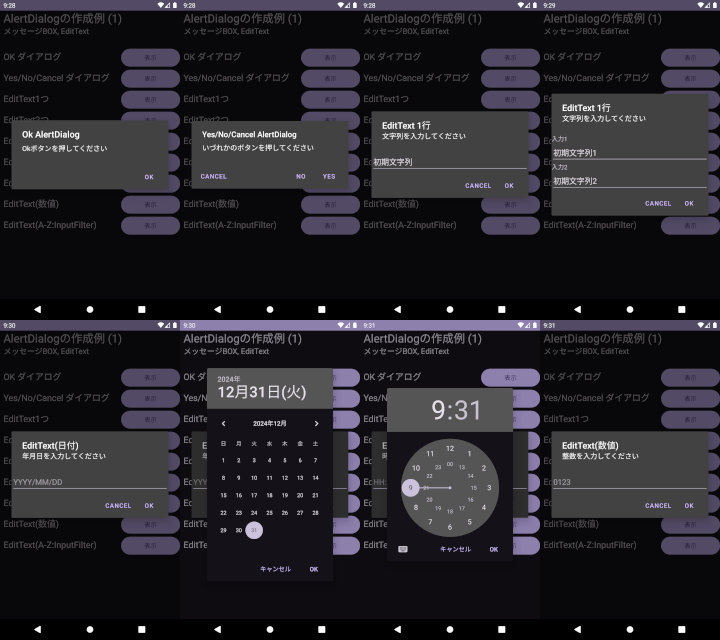
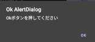
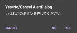
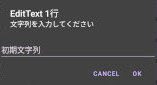
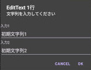
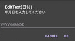
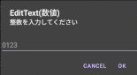

## AlertDialogを用いたYes/No/Cancelダイアログや、EditText（テキストボックス）の作成方法<!-- omit in toc -->

---
[Home](https://oasis3855.github.io/webpage/) > [Software](https://oasis3855.github.io/webpage/software/index.html) > [ソフトウエア開発・PC管理のメモ帳](https://oasis3855.github.io/webpage/software/software_server_memo.html) > [Workspace_Android](../README.md)  > ***UserInterface_Widget*** (this page)

<br />
<br />

Last Updated : 2024/12/31

- [概要](#概要)
- [ソースコード](#ソースコード)
- [単純なメッセージボックス](#単純なメッセージボックス)
  - [Okダイアログ](#okダイアログ)
  - [Yes/No/Cancelダイアログ](#yesnocancelダイアログ)
- [EditText（テキストボックス）](#edittextテキストボックス)
  - [最も基本的なテキストボックス](#最も基本的なテキストボックス)
  - [日付・時刻入力をさせるテキストボックス](#日付時刻入力をさせるテキストボックス)
    - [EditText.setInputType による制限方法](#edittextsetinputtype-による制限方法)
    - [DatePickerDialogやTimePickerDialogの利用](#datepickerdialogやtimepickerdialogの利用)
  - [英数字等に限定し入力させるテキストボックス](#英数字等に限定し入力させるテキストボックス)
    - [EditText.setInputType による制限方法](#edittextsetinputtype-による制限方法-1)
    - [InputFilterの利用](#inputfilterの利用)

<br />
<br />

## 概要

AlertDialogを用いたYes/No/Cancelダイアログや、EditText（テキストボックス）の作成方法。テキストボックスは、英数字限定や日時入力などの機能を付加することもここで説明している。



<br />
<br />

## ソースコード

- [Javaソースコード : MainActivity.java](./app/src/main/java/com/example/alertdialogtest01_inline/MainActivity.java)
- [レイアウトXML : activity_main.xml](./app/src/main/res/layout/activity_main.xml)

<br />
<br />

## 単純なメッセージボックス

### Okダイアログ

これがAlertDialogの最も基本的な書き方となる



```java
new AlertDialog.Builder(this)
        .setTitle("Ok AlertDialog")
        .setMessage("Okボタンを押してください")
        .setPositiveButton("Ok", new DialogInterface.OnClickListener() {
            @Override
            public void onClick(DialogInterface dialogInterface, int i) {
                Toast toast = Toast.makeText(MainActivity.this, "Okが押された", Toast.LENGTH_LONG);
                toast.show();
            }
        })
        .show();
```

<br />
<br />

### Yes/No/Cancelダイアログ

AlertDialog.Builder には、最大3つのボタンが設置できる。それぞれ、```setPositiveButton , setNegativeButton , setNeutralButton``` メソッドで設定する。



```java
new AlertDialog.Builder(this)
        .setTitle("Yes/No/Cancel AlertDialog")
        .setMessage("いづれかのボタンを押してください")
        .setPositiveButton("Yes", new DialogInterface.OnClickListener() {
            @Override
            public void onClick(DialogInterface dialogInterface, int i) {
                Toast toast = Toast.makeText(MainActivity.this, "Yesが押された", Toast.LENGTH_LONG);
                toast.show();
            }
        })
        .setNegativeButton("No", new DialogInterface.OnClickListener() {
            @Override
            public void onClick(DialogInterface dialogInterface, int i) {
                Toast toast = Toast.makeText(MainActivity.this, "Noが押された", Toast.LENGTH_LONG);
                toast.show();
            }
        })
        .setNeutralButton("Cancel", new DialogInterface.OnClickListener() {
            @Override
            public void onClick(DialogInterface dialogInterface, int i) {
                Toast toast = Toast.makeText(MainActivity.this, "Cancelが押された", Toast.LENGTH_LONG);
                toast.show();
            }
        })
        .setCancelable(true)
        .show();
```

<br />
<br />

## EditText（テキストボックス）

### 最も基本的なテキストボックス

テキストボックス1個のときは、下の例のように直接AlertDialog.Builder.setViewで紐付ける。



```java
// テキスト入力インターフェース
final EditText inputText = new EditText(this);
inputText.setLines(1);
inputText.setText("初期文字列");
inputText.setInputType(InputType.TYPE_CLASS_TEXT);

new AlertDialog.Builder(this)
        .setTitle("EditText 1行")
        .setMessage("文字列を入力してください")
        // テキスト入力インターフェース1個を紐付け
        .setView(inputText)
        .setPositiveButton("Ok", new DialogInterface.OnClickListener() {
            @Override
            public void onClick(DialogInterface dialogInterface, int i) {
                Toast toast = Toast.makeText(MainActivity.this, "入力された文字列 : " + inputText.getText().toString(), Toast.LENGTH_LONG);
                toast.show();
            }
        })
        .setNegativeButton("Cancel", new DialogInterface.OnClickListener() {
            @Override
            public void onClick(DialogInterface dialogInterface, int i) {
                Toast toast = Toast.makeText(MainActivity.this, "Cancelが押された", Toast.LENGTH_LONG);
                toast.show();
            }
        })
        .show();
```

<br />
<br />

複数の入力インターフェースが必要な場合は、LinearLayoutを介してAlertDialog.Builder.setViewで紐付ける。



```java
// 複数のユーザ インターフェースを縦列配置するレイアウトを定義
final LinearLayout layout = new LinearLayout(this);
layout.setOrientation(LinearLayout.VERTICAL);
// テキスト入力インターフェース 1つめ
TextView text1 = new TextView(this);
text1.setText("入力1");
layout.addView(text1);

final EditText inputText1 = new EditText(this);
inputText1.setLines(1);
inputText1.setText("初期文字列1");
inputText1.setInputType(InputType.TYPE_CLASS_TEXT);

// 作成したテキスト入力インターフェースをレイアウトに追加する
layout.addView(inputText1);

// テキスト入力インターフェース 2つめ
TextView text2 = new TextView(this);
text2.setText("入力2");
layout.addView(text2);

final EditText inputText2 = new EditText(this);
inputText2.setLines(1);
inputText2.setText("初期文字列2");
inputText2.setInputType(InputType.TYPE_CLASS_TEXT);

// 作成したテキスト入力インターフェースをレイアウトに追加する
layout.addView(inputText2);

new AlertDialog.Builder(this)
        .setTitle("EditText 1行")
        .setMessage("文字列を入力してください")
        // レイアウトを紐付け
        .setView(layout)
        .setPositiveButton("Ok", new DialogInterface.OnClickListener() {

// 〜 以降省略 〜
```

<br />
<br />

### 日付・時刻入力をさせるテキストボックス

#### EditText.setInputType による制限方法

EditTextにsetInputTypeメソッドを使って入力値の制限を加えても、仮想キーボードから「意図しない」入力は可能。

次の例ではASCII（英数字）キーボードが表示されるので、「12:34」のような求める形だけでなく、「123:456」など意図しない桁数や、「abcd」などのキーボードに存在する他の文字も入力できてしまう。



```java
final EditText inputText = new EditText(this);
inputText.setLines(1);
inputText.setHint("YYYY/MM/DD");
// setInputTypeはキーボードの初期値を決めるだけで、日付に合致しない文字列でも入力できてしまう
inputText.setInputType(InputType.TYPE_CLASS_DATETIME | InputType.TYPE_DATETIME_VARIATION_DATE);

```

<br />
<br />

#### DatePickerDialogやTimePickerDialogの利用

日付・時刻の入力において意図しない値を回避するには、EditTextを編集不可に設定し、クリックするとDatePickerDialogやTimePickerDialogを表示すれば良い。

  &nbsp;&nbsp;&nbsp; 

```java
final EditText inputText = new EditText(this);
inputText.setLines(1);
inputText.setHint("YYYY/MM/DD");
// キーボードを表示しない
inputText.setInputType(InputType.TYPE_NULL);
// テキスト入力インターフェースをクリックしたときの処理
inputText.setOnClickListener(new View.OnClickListener() {
    @Override
    public void onClick(View view) {
        // カレンダー ダイアログを表示する（ユーザ定義したメソッドを呼び出す）
        showDatePickerDialog(inputText);
    }
});
```

```java
private void showDatePickerDialog(EditText inputText) {
    // 現在の日付を取得（ダイアログの初期値として利用するため）
    final Calendar calendar = Calendar.getInstance();
    int year = calendar.get(Calendar.YEAR);
    int month = calendar.get(Calendar.MONTH);
    int day = calendar.get(Calendar.DAY_OF_MONTH);

    // 日付選択ダイアログの構築
    DatePickerDialog datePickerDialog = new DatePickerDialog(this, new DatePickerDialog.OnDateSetListener() {
        @Override
        public void onDateSet(DatePicker view, int year, int monthOfYear, int dayOfMonth) {
            // 選択された日付をEditTextに表示
            inputText.setText(String.format("%d/%02d/%02d", year, monthOfYear + 1, dayOfMonth));
        }
    }, year, month, day);

    // 日付選択ダイアログの表示
    datePickerDialog.show();
}
```

<br />
<br />

### 英数字等に限定し入力させるテキストボックス

#### EditText.setInputType による制限方法

次の例では、数値キーボードが表示されるため、少なくともアルファベットが入力されることは阻止できる。しかし、「ピリオド」「マイナス」キーも表示されているため、これを制限することはできない。



```java
        final EditText inputText = new EditText(this);
        inputText.setLines(1);
        inputText.setHint("0123");
        // setInputTypeはキーボードの初期値を決めるだけで、数値に合致しない文字列でも入力できてしまう
        inputText.setInputType(InputType.TYPE_CLASS_NUMBER | InputType.TYPE_NUMBER_FLAG_DECIMAL);
```

<br />
<br />

#### InputFilterの利用

InputFilterを利用すると、ほぼ完全に意図しない入力を防ぐことができる。次の例はアルファベット大文字（ABC〜XYZ）に制限する方法を示している。

```java
final EditText inputText = new EditText(this);
inputText.setLines(1);
inputText.setHint("ABC...XYZ");
// setInputTypeはキーボードの初期値を決めるだけで、大文字A-Zに合致しない文字列でも入力できてしまう
inputText.setInputType(InputType.TYPE_CLASS_TEXT | InputType.TYPE_TEXT_FLAG_CAP_CHARACTERS);
// 入力フィルターを定義
InputFilter filter_AZ = new InputFilter() {
    @Override
    public CharSequence filter(CharSequence charSequence, int i, int i1, Spanned spanned, int i2, int i3) {
        if (charSequence.toString().matches("^[A-Z]+$")) {
            return charSequence;
        } else {
            return "";
        }
    }
};
// テキスト入力インターフェースに、ユーザ定義した入力フィルターを紐付け
inputText.setFilters(new InputFilter[]{filter_AZ});
```
