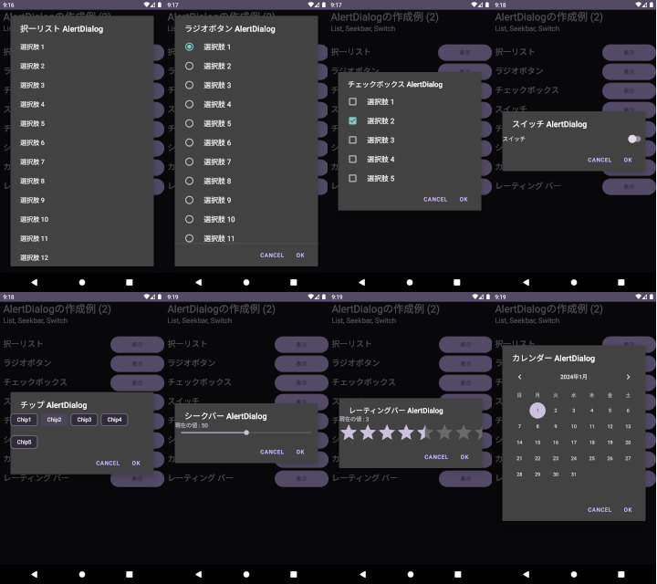
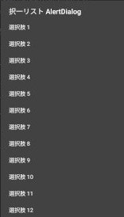
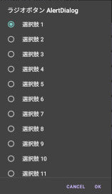
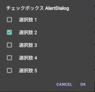
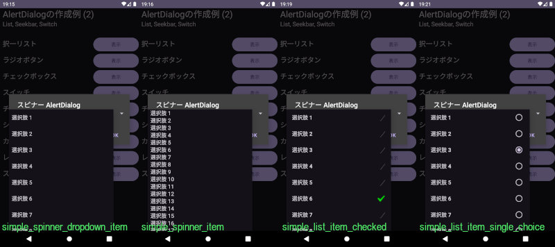
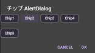
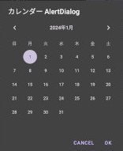

## AlertDialogを用いたリスト、スイッチ、シークバー等の作成方法<!-- omit in toc -->

---
[Home](https://oasis3855.github.io/webpage/) > [Software](https://oasis3855.github.io/webpage/software/index.html) > [ソフトウエア開発・PC管理のメモ帳](https://oasis3855.github.io/webpage/software/software_server_memo.html) > [Workspace_Android](../README.md)  > ***UserInterface_Widget*** (this page)

<br />
<br />

Last Updated : 2025/01/09

- [概要](#概要)
- [ソースコード](#ソースコード)

<br />
<br />

## 概要

AlertDialogを用いたリスト選択・ラジオボタン選択・チェックボックス選択、スライダーによる値入力、カレンダーダイアログの作成方法。



<br />
<br />

## ソースコード

- [Javaソースコード : MainActivity.java](./app/src/main/java/com/example/alertdialogtest02_inline/MainActivity.java)
- [レイアウトXML : activity_main.xml](./app/src/main/res/layout/activity_main.xml)

<br />
<br />

## リスト類

### 択一リスト（AlertDialog.Builder.setItems）

いわゆるスクロールリストを表示して、1項目の選択を促すもの。

AlertDialog.BuilderのsetItemsメソッドに選択肢の配列を渡すことで、択一リスト表示モードとなる。

Ok/Cancelボタンなどはなく、項目をタップすればすぐにAlertDialogが正常終了する。



```java
// 選択肢をString配列に格納する
final String[] items = new String[20];
for (int i = 0; i < 20; i++)
    items[i] = String.format("選択肢 %d", i + 1);
// Alert Dialogを構築・表示
new AlertDialog.Builder(this)
        .setTitle("択一リスト AlertDialog")
        // リスト表示において、setMessageメソッドは利用できない
        // .setMessage("リストより1つ選択してください")
        // 選択肢を格納した文字列配列を設定し、選択肢をクリックしたときの処理を記述する
        .setItems(items, new DialogInterface.OnClickListener() {
            @Override
            public void onClick(DialogInterface dialogInterface, int i) {
                Toast toast = Toast.makeText(MainActivity.this, "選択 : " + items[i], Toast.LENGTH_LONG);
                toast.show();
            }
        })
        .show();
```

<br />
<br />

### ラジオボタン（AlertDialog.Builder.setSingleChoiceItems）

ラジオボタンを表示して、1項目の選択を促すもの。

AlertDialog.BuilderのsetSingleChoiceItemsメソッドに選択肢の配列を渡すことで、ラジオボタン表示モードとなる。

項目を選択後、Okボタンを押してAlertDialogを終了する。

OkボタンのonClickイベント内で選択中のボタンindexは読み取れないので、AlertDialog表示中に項目をタップされるたびに、選択中のindex番号を一時保存しておき、それをOkダイアログを押されたときに利用する。



```java
// 選択肢をString配列に格納する
final String[] items = new String[20];
for (int i = 0; i < 20; i++)
    items[i] = String.format("選択肢 %d", i + 1);
// Alert Dialog表示中に選択された選択肢のindex番号を一時保管する変数
int[] idxSelected = {0};
// Alert Dialogを構築・表示
new AlertDialog.Builder(this)
        .setTitle("ラジオボタン AlertDialog")
        // 選択肢を格納した文字列配列を設定し、選択肢をクリックしたときの処理を記述する
        .setSingleChoiceItems(items, 0, new DialogInterface.OnClickListener() {
            @Override
            // クリックされた選択肢（ラジオボタン）の位置を覚えておき、setPositiveButtonのクリック時に読み出す
            public void onClick(DialogInterface dialogInterface, int i) {
                idxSelected[0] = i;
            }
        })
        .setPositiveButton("OK", new DialogInterface.OnClickListener() {
            @Override
            public void onClick(DialogInterface dialogInterface, int i) {
                Toast toast = Toast.makeText(MainActivity.this, "選択 : " + items[idxSelected[0]], Toast.LENGTH_LONG);
                toast.show();
            }
        })
        .show();
```

<br />
<br />

### チェックボックス（AlertDialog.Builder.setMultiChoiceItems）

チェックボックスを表示して、複数項目の選択を促すもの。

AlertDialog.BuilderのsetMultiChoiceItemsメソッドに選択肢の配列を渡すことで、チェックボックス表示モードとなる。

項目を選択後、Okボタンを押してAlertDialogを終了する。


OkボタンのonClickイベント内で選択中のボタンindexは読み取れないので、AlertDialog表示中に項目をタップされるたびに、選択中のindex番号のtrue/falseを一時保存しておき、それをOkダイアログを押されたときに利用する。



```java
// 選択肢をString配列に格納する
final String[] items = new String[5];
for (int i = 0; i < 5; i++)
    items[i] = String.format("選択肢 %d", i + 1);
// チェックボックス状態の初期値（trueはチェックされた状態）
boolean[] idxChecked = {false, false, false, false, false};
// Alert Dialogを構築・表示
new AlertDialog.Builder(this)
        .setTitle("チェックボックス AlertDialog")
        // 選択肢を格納した文字列配列・チェック状態の配列を設定し、選択肢をクリックしたときの処理を記述する
        .setMultiChoiceItems(items, idxChecked, new DialogInterface.OnMultiChoiceClickListener() {
            @Override
            public void onClick(DialogInterface dialogInterface, int i, boolean b) {
                // チェック状態が変化したら、（setPositiveButtonのクリック時に参照するために）保存する
                idxChecked[i] = b;
            }
        })
        .setPositiveButton("OK", new DialogInterface.OnClickListener() {
            @Override
            public void onClick(DialogInterface dialogInterface, int i) {
                String str = "";
                for (int j = 0; j < idxChecked.length; j++) {
                    str += idxChecked[j] ? "ON " : "OFF ";
                }
                Toast toast = Toast.makeText(MainActivity.this, "チェック状態 : " + str, Toast.LENGTH_LONG);
                toast.show();
            }
        })
        .show();
```

<br />
<br />

### スピナー

ドロップダウン・リストのことだが、選択肢の表示形式を「択一リスト風」「ラジオボタン風」など切り替えることもできる。



表示形式の切り替えは adapter.setDropDownViewResource の引数で指定する。主なものは…

- simple_spinner_dropdown_item : 択一リスト風
- simple_spinner_item : 伝統的なドロップダウン・リスト
- simple_list_item_checked : チェックボックス風
- simple_list_item_single_choice : ラジオボタン風

応用編として、複数選択可能名表示形式などもある。

```java
// 選択肢をString配列に格納する
final String[] items = new String[20];
for (int i = 0; i < 20; i++)
    items[i] = String.format("選択肢 %d", i + 1);
// ArrayAdapterを作成し、選択肢の配列を紐付け
ArrayAdapter<String> adapter = new ArrayAdapter<>(this, android.R.layout.simple_spinner_item, items);
adapter.setDropDownViewResource(android.R.layout.simple_spinner_dropdown_item);
// スピナーを定義
Spinner spinner = new Spinner(this);
spinner.setAdapter(adapter);
// Alert Dialogを構築・表示
new AlertDialog.Builder(this)
        .setTitle("スピナー AlertDialog")
        .setView(spinner)
        .setPositiveButton("OK", new DialogInterface.OnClickListener() {
            @Override
            public void onClick(DialogInterface dialogInterface, int i) {
                Toast toast = Toast.makeText(MainActivity.this, "選択 : " + spinner.getSelectedItem(), Toast.LENGTH_LONG);
                toast.show();
            }
        })
        .show();
```

<br />
<br />

### スイッチ

スライド・スイッチを表示する。

Switch / SwitchCompat / SwitchMaterial のいづれでも動作可（見かけも同じ）。 Android StudioではSwitchクラスを使うと非推奨の警告が出る。


```java
// スイッチwidgetを作成し、レイアウトに紐付ける
// Switch/SwitchCompat/SwitchMaterial のいづれでも動作可。見た目も変わらない模様
final SwitchMaterial switchctl = new SwitchMaterial(this);
switchctl.setText("スイッチ");

LinearLayout layout = new LinearLayout(this);
layout.setOrientation(LinearLayout.VERTICAL);
layout.addView(switchctl);
// Alert Dialogを構築・表示
new AlertDialog.Builder(this)
        .setTitle("スイッチ AlertDialog")
        .setView(layout)
        .setPositiveButton("OK", new DialogInterface.OnClickListener() {
            @Override
            public void onClick(DialogInterface dialogInterface, int i) {
                Toast toast = Toast.makeText(MainActivity.this, "スイッチ状態 : " + (switchctl.isChecked() ? "ON" : "OFF"), Toast.LENGTH_LONG);
                toast.show();

            }
        })
        .show();
```

<br />
<br />

### チップ

チップ（押しボタン式の選択）を表示する。ON/OFF状態が分かりづらいと感じるのは、私だけだろうか…。



```java
// 複数のChipをChipGroupにまとめて紐付ける
ChipGroup chipgrp = new ChipGroup(this);
for (int j = 0; j < 5; j++) {
    Chip chip = new Chip(this);
    chip.setText("Chip" + Integer.toString(j + 1));
    chip.setCheckable(true);
    chipgrp.addView(chip);
}

LinearLayout layout = new LinearLayout(this);
layout.setOrientation(LinearLayout.VERTICAL);
layout.addView(chipgrp);
// Alert Dialogを構築・表示
new AlertDialog.Builder(this)
        .setTitle("チップ AlertDialog")
        .setView(layout)
        .setPositiveButton("OK", new DialogInterface.OnClickListener() {
            @Override
            public void onClick(DialogInterface dialogInterface, int i) {
                String str = "";
                for (int j = 0; j < chipgrp.getChildCount(); j++) {
                    Chip chip = (Chip) chipgrp.getChildAt(j);
                    str += chip.isChecked() ? "ON " : "OFF ";
                }
                Toast toast = Toast.makeText(MainActivity.this, "チップ状態 : " + str, Toast.LENGTH_LONG);
                toast.show();

            }
        })
        .show();
```

<br />
<br />

### シークバー

シークバー（スライド調節バー）を表示する。ゼロ（0）〜指定値（整数）の変化範囲を設定できるので、負の値や小数点を選択肢としたい場合はユーザ実装が必要。


```java
final TextView text = new TextView(this);
text.setText("現在の値 : 50");

final SeekBar seekbar = new SeekBar(this);
// setMinはAPI26以上でしかサポートされない
//seekbar.setMin(0);
seekbar.setMax(100);
// 初期値は50とする
seekbar.setProgress(50);
// 左右キーで10刻みで調整可能にする（シークバーをドラッグした場合は、この設定値以外もとり得る）
seekbar.setKeyProgressIncrement(10);
seekbar.setOnSeekBarChangeListener(new SeekBar.OnSeekBarChangeListener() {
    @Override
    public void onProgressChanged(SeekBar seekBar, int i, boolean b) {
        // 読み出した値が10刻みでない場合は、1の位を切り捨ててシークバーの値を再設定する
        int j = (i / 10) * 10;
        if (i != j) {
            seekbar.setProgress(j);
        }
        text.setText("現在の値 : " + j);
    }
});

// シークバーをレイアウトに紐付け
LinearLayout layout = new LinearLayout(this);
layout.setOrientation(LinearLayout.VERTICAL);
layout.addView(text);
layout.addView(seekbar);

// Alert Dialogを構築・表示
new AlertDialog.Builder(this)
        .setTitle("シークバー AlertDialog")
        .setView(layout)
        .setPositiveButton("OK", new DialogInterface.OnClickListener() {
            @Override
            public void onClick(DialogInterface dialogInterface, int i) {
                Toast toast = Toast.makeText(MainActivity.this, "値 : " + seekbar.getProgress(), Toast.LENGTH_LONG);
                toast.show();

            }
        })
        .show();
```

<br />
<br />

### レーティングバー

シークバーの「星」版。アプリの評価の入力ダイアログなどに使われているあれである。

ゼロ（0）から指定値（浮動小数点数）の変化範囲がある。


```java
final TextView text = new TextView(this);
text.setText("現在の値 : 3");

// レーティングバーを定義
final RatingBar ratingbar = new RatingBar(this);
// 最大値を5とする
ratingbar.setNumStars(5);
// 変化ステップを1にする
ratingbar.setStepSize(1.0f);
// 初期値
ratingbar.setRating(3.0f);
ratingbar.setOnRatingBarChangeListener(new RatingBar.OnRatingBarChangeListener() {
    @Override
    public void onRatingChanged(RatingBar ratingBar, float v, boolean b) {
        text.setText("現在の値 : " + String.format("%1.0f", v));
    }
});

// レーティングバーをレイアウトに紐付け
LinearLayout layout = new LinearLayout(this);
layout.setOrientation(LinearLayout.VERTICAL);
layout.addView(text);
layout.addView(ratingbar);

// Alert Dialogを構築・表示
new AlertDialog.Builder(this)
        .setTitle("レーティングバー AlertDialog")
        .setView(layout)
        .setPositiveButton("OK", new DialogInterface.OnClickListener() {
            @Override
            public void onClick(DialogInterface dialogInterface, int i) {
                Toast toast = Toast.makeText(MainActivity.this, "評価値 : " + ratingbar.getRating(), Toast.LENGTH_LONG);
                toast.show();
            }
        })
        .show();
```

<br />
<br />

### カレンダーView

これはAlertDialogではなく、カレンダーViewを表示するサンプル。



```java
// 年月日をViewに設定・Viewから読み出すための変数
Calendar selectdate = Calendar.getInstance();
// 年月日の初期設定。月は0から
selectdate.set(2024, 0, 1);
// カレンダーViewを構築
final CalendarView calendar = new CalendarView(this);
calendar.setDate(selectdate.getTimeInMillis());
calendar.setOnDateChangeListener(new CalendarView.OnDateChangeListener() {
    @Override
    public void onSelectedDayChange(@NonNull CalendarView calendarView, int i, int i1, int i2) {
        // 現在の選択年月日を保存しておく（i=year, i1=month-1, i2=day）
        selectdate.set(i, i1, i2);
    }
});

LinearLayout layout = new LinearLayout(this);
layout.setOrientation(LinearLayout.VERTICAL);
layout.addView(calendar);

// Alert Dialogを構築・表示
new AlertDialog.Builder(this)
        .setTitle("カレンダー AlertDialog")
        .setView(layout)
        .setPositiveButton("OK", new DialogInterface.OnClickListener() {
            @Override
            public void onClick(DialogInterface dialogInterface, int i) {
                SimpleDateFormat sdf = new SimpleDateFormat("yyyy/MM/dd");
                Toast toast = Toast.makeText(MainActivity.this, "選択日 : " + sdf.format(selectdate.getTime()), Toast.LENGTH_LONG);
                toast.show();
            }
        })
        .show();
```
