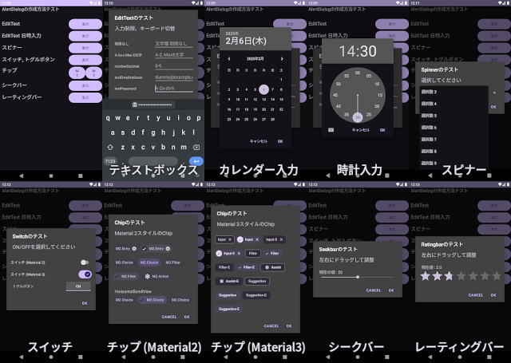
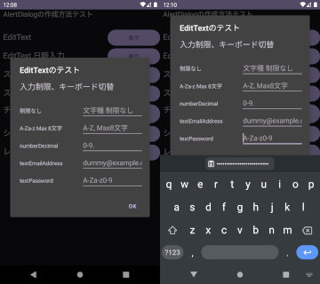
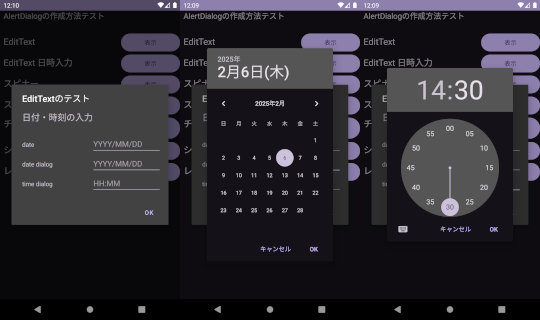
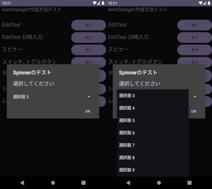
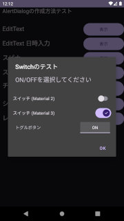
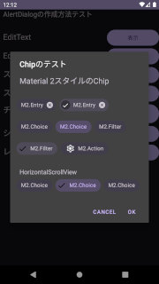
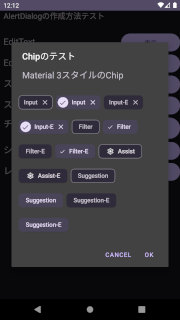
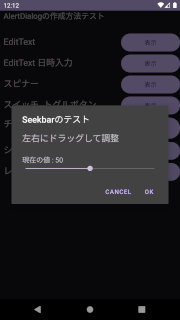
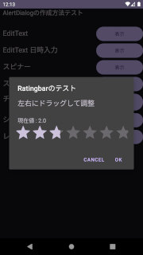

## AlertDialogを用いたテキストボックス、リスト、スイッチ、シークバー等の作成方法（XMLレイアウト方式）<!-- omit in toc -->

---
[Home](https://oasis3855.github.io/webpage/) > [Software](https://oasis3855.github.io/webpage/software/index.html) > [ソフトウエア開発・PC管理のメモ帳](https://oasis3855.github.io/webpage/software/software_server_memo.html) > [Workspace_Android](../README.md)  > ***UserInterface_Widget*** (this page)

<br />
<br />

Last Updated : 2025/03/02

- [概要](#概要)
- [ソースコード](#ソースコード)
- [テキストボックス](#テキストボックス)
  - [テキストボックス（入力文字の制限）](#テキストボックス入力文字の制限)
  - [テキストボックス（年月日・時刻ダイアログを表示）](#テキストボックス年月日時刻ダイアログを表示)
- [スピナー](#スピナー)
- [スイッチ](#スイッチ)
- [チップ](#チップ)
- [シークバー](#シークバー)
- [レーティングバー](#レーティングバー)

<br />
<br />

## 概要

AlertDialogを用いたテキストボックス、リスト選択・ラジオボタン選択・チェックボックス選択、スライダーによる値入力の作成方法。

レイアウトをXML形式で作成する方式をここで説明する。



<br />
<br />

なお、xmlレイアウトを使わずjava内ですべて定義したい場合は、[AlertDialogTest01](../AlertDialogTest01/)（テキストボックス）と[AlertDialogTest02](../AlertDialogTest02/)（スイッチやシークバー等）を参照のこと。

## ソースコード

- [Javaソースコード : MainActivity.java](./app/src/main/java/com/example/alertdialogtest03/MainActivity.java)
- [メニューのレイアウトXML : activity_main.xml](./app/src/main/res/layout/activity_main.xml)

<br />
<br />

## テキストボックス

### テキストボックス（入力文字の制限）

入力文字の制限付きテキストボックスを作成する。```android:inputType```で文字種の制限を行うと、キーボードの種類も自動的に適合したものが表示される。



- [Javaソースコード : MainActivity.java](./app/src/main/java/com/example/alertdialogtest03/MainActivity.java)


```java
LayoutInflater inflater = getLayoutInflater();
View view = inflater.inflate(R.layout.layout_edittext, null);

// AlertDialogの表示
AlertDialog.Builder builder = new AlertDialog.Builder(this);
builder.setView(view)
        .setTitle("EditTextのテスト")
        // OKボタンを押したときの処理
        .setPositiveButton("Ok", new DialogInterface.OnClickListener() {
            @Override
            public void onClick(DialogInterface dialogInterface, int i) {
                final EditText editText_all = view.findViewById(R.id.editText_all);
                final EditText editText_A2zMaxlen = view.findViewById(R.id.editText_A2zMaxlen);
                final EditText editText_Number = view.findViewById(R.id.editText_Number);
                final EditText editText_Email = view.findViewById(R.id.editText_Email);
                final EditText editText_Password = view.findViewById(R.id.editText_Password);
                Toast toast = Toast.makeText(MainActivity.this,
                        "1) : " + editText_all.getText() + "\n2)" + editText_A2zMaxlen.getText() +
                                "\n3)" + editText_Number.getText() + "\n4)" + editText_Email.getText() +
                                "\n4)" + editText_Password.getText(), Toast.LENGTH_LONG);
                toast.show();
            }
        })
        .show();
```

・[レイアウトXML](./app/src/main/res/layout/layout_edittext.xml)

XMLの属性値はAndroid Developers「[TextView](https://developer.android.com/reference/android/widget/TextView)」に列挙されている。よく使う値を次に示す。

主な入力制限のXML属性値

| 属性              | 値            | 説明                     |
| ----------------- | ------------- | ------------------------ |
| android:inputType | text          | テキスト文字列           |
| android:inputType | number        | 数値                     |
| android:inputType | numberSigned  | 符号付き数値             |
| android:inputType | numberDecimal | 整数                     |
| android:inputType | date          | 年月日                   |
| android:inputType | time          | 時刻                     |
| android:inputType | textPassword  | パスワード（●●● と表示） |

特定文字のフィルターを行うXML属性値

| 属性           | 値           | 説明                         |
| -------------- | ------------ | ---------------------------- |
| android:digits | "abcdefg"    | 「abcdefg」だけが入力可能    |
| android:digits | "1234567890" | 「1234567890」だけが入力可能 |

文字の長さを規定するXML属性値

| 属性              | 値   | 説明                 |
| ----------------- | ---- | -------------------- |
| android:maxLength | "16" | 最大16文字が入力可能 |


android:inputTypeやandroid:inputTypeでの入力文字種の規定よりも「高度な」ものは、java側でInputFilterを用いる必要がある。詳細は[AlertDialogTest01](../AlertDialogTest01/)の「InputFilterの利用」javaソースコードを参照。

テキストボックスを定義している部分を一部抜粋して次に掲載する。

```xml
<!-- 文字種別・長さ制限なしの 通常のテキストボックス -->
<EditText
    android:id="@+id/editText_all"
    android:hint="文字種 制限なし" />

<!-- 「アルファベットと空白のみ」の文字種別制限・「最大8文字」の長さ制限のテキストボックス -->
<EditText
    android:id="@+id/editText_A2zMaxlen"
    android:digits="ABCDEFGHIJKLMNOPQRSTUVWXYZabcdefghijklmnopqrstuvwxyz "
    android:hint="A-Z, Max8文字"
    android:inputType="text"
    android:maxLength="8" />

<!-- 「数字およびピリオドのみ」の文字種別制限・長さ制限なしのテキストボックス -->
<EditText
    android:id="@+id/editText_Number"
    android:hint="0-9."
    android:inputType="numberDecimal" />

<!-- 「Emailアドレスとして認識できる」文字種別制限・長さ制限なしのテキストボックス -->
<EditText
    android:id="@+id/editText_Email"
    android:hint="dummy@example.com"
    android:inputType="textEmailAddress" />

<!-- 「アルファベットと空白、数字のみ」の文字種別制限・長さ制限なしの「パスワード」テキストボックス -->
<EditText
    android:id="@+id/editText_Password"
    android:digits="ABCDEFGHIJKLMNOPQRSTUVWXYZabcdefghijklmnopqrstuvwxyz0123456789"
    android:hint="A-Za-z0-9"
    android:inputType="textPassword" />
```

<br />
<br />

### テキストボックス（年月日・時刻ダイアログを表示）

クリックしたら日時ダイアログを表示するテキストボックスを作成する。ダイアログを使った入力を規定するのはXML側ではなく、java側で「テキストボックスをクリックした場合」のプログラムを行う。



- [Javaソースコード : MainActivity.java](./app/src/main/java/com/example/alertdialogtest03/MainActivity.java)

```java
LayoutInflater inflater = getLayoutInflater();
View view = inflater.inflate(R.layout.layout_edittext_datetime, null);

// EditTextをクリックしたときに、DatePickerDialog を表示する
final EditText editText_DateDialog = view.findViewById(R.id.editText_DateDialog);
editText_DateDialog.setOnClickListener(new View.OnClickListener() {
    @Override
    public void onClick(View view) {
        showDatePickerDialog(editText_DateDialog);
    }
});

// EditTextをクリックしたときにキーボードを表示するのを抑止する
editText_DateDialog.setOnTouchListener(new View.OnTouchListener() {
    @Override
    public boolean onTouch(View view, MotionEvent motionEvent) {
        if (motionEvent.getAction() == MotionEvent.ACTION_DOWN) {
            // ソフトキーボードを表示しないようにする
            // editText_DateDialog.setInputType(InputType.TYPE_NULL);
            editText_DateDialog.requestFocus();
            editText_DateDialog.performClick(); // DatePickerDialogを表示
        }
        return true;
    }
});

// 〜〜〜 省略 〜〜〜

// AlertDialogを表示する
AlertDialog.Builder builder = new AlertDialog.Builder(this);
builder.setView(view)
        .setTitle("EditTextのテスト")
        // OKボタンを押したときの処理
        .setPositiveButton("Ok", new DialogInterface.OnClickListener() {
            @Override
            public void onClick(DialogInterface dialogInterface, int i) {
                final EditText editText_Date = view.findViewById(R.id.editText_Date);
                final EditText editText_DateDialog = view.findViewById(R.id.editText_DateDialog);
                final EditText editText_TimeDialog = view.findViewById(R.id.editText_TimeDialog);
                Toast toast = Toast.makeText(MainActivity.this,
                        "1) : " + editText_Date.getText() + "\n2)" + editText_DateDialog.getText() +
                                "\n3)" + editText_TimeDialog.getText(), Toast.LENGTH_LONG);
                toast.show();
            }
        })
        .show();
```

年月日を選択するダイアログを表示する

```java
private void showDatePickerDialog(EditText inputText) {
    // 現在の日付を取得（ダイアログの初期値として利用するため）
    final Calendar calendar = Calendar.getInstance();
    int year = calendar.get(Calendar.YEAR);
    int month = calendar.get(Calendar.MONTH);
    int day = calendar.get(Calendar.DAY_OF_MONTH);

    // 日付選択ダイアログの構築
    DatePickerDialog datePickerDialog = new DatePickerDialog(this, new DatePickerDialog.OnDateSetListener() {
        @Override
        public void onDateSet(DatePicker view, int year, int monthOfYear, int dayOfMonth) {
            // 選択された日付をEditTextに表示
            inputText.setText(String.format("%d/%02d/%02d", year, monthOfYear + 1, dayOfMonth));
        }
    }, year, month, day);

    // 日付選択ダイアログの表示
    datePickerDialog.show();
}
```

・[レイアウトXML](./app/src/main/res/layout/layout_edittext_datetime.xml)

XMLの属性値はAndroid Developers「[TextView](https://developer.android.com/reference/android/widget/TextView)」に列挙されている。ダイアログを表示しての入力を行うテキストボックスは、次の属性を定義する。

| 属性              | 値     | 説明                       |
| ----------------- | ------ | -------------------------- |
| android:inputType | "none" | 無効（別途ダイアログ入力） |

```xml
<!-- 年月日を入力させるテキストボックス。入力可能な文字が「0-9」と「/」に制限される -->
<EditText
    android:id="@+id/editText_Date"
    android:digits="1234567890/"
    android:hint="YYYY/MM/DD"
    android:inputType="date"
    android:maxLength="10" />

<!-- 年月日を「ダイアログを表示して」入力させるテキストボックス -->
<EditText
    android:id="@+id/editText_DateDialog"
    android:hint="YYYY/MM/DD"
    android:inputType="none" />

<!-- 時刻を「ダイアログを表示して」入力させるテキストボックス -->
<EditText
    android:id="@+id/editText_TimeDialog"
    android:hint="HH:MM"
    android:inputType="none" />
```

<br />
<br />

## スピナー

いわゆるドロップダウンリストを表示するのがスピナー。




リストの内容や初期選択値など、スピナーの主要部分はXMLではなくjavaで規定する。

表示形式の切り替えは adapter.setDropDownViewResource の引数で指定する。主なものに、次のようなデザインがある。

| リソース名                     | デザイン                       |
| ------------------------------ | ------------------------------ |
| simple_spinner_dropdown_item   | 択一リスト風                   |
| simple_spinner_item            | 伝統的なドロップダウン・リスト |
| simple_list_item_checked       | チェックボックス風             |
| simple_list_item_single_choice | ラジオボタン風                 |

応用編として、複数選択可能な表示形式などもある。

- [Javaソースコード : MainActivity.java](./app/src/main/java/com/example/alertdialogtest03/MainActivity.java)

```java
LayoutInflater inflater = getLayoutInflater();
View view = inflater.inflate(R.layout.layout_spinner, null);

// 選択肢をString配列に格納する
final String[] items = new String[20];
for (int i = 0; i < 20; i++)
    items[i] = String.format("選択肢 %d", i + 1);
// ArrayAdapterを作成し、選択肢の配列を紐付け
ArrayAdapter<String> adapter = new ArrayAdapter<>(this, android.R.layout.simple_spinner_item, items);
// スピナーの表示形式を指定する
//      simple_spinner_dropdown_item : 択一リスト風
//      simple_spinner_item : 伝統的なドロップダウン・リスト
//      simple_list_item_checked : チェックボックス風
//      simple_list_item_single_choice : ラジオボタン風
adapter.setDropDownViewResource(android.R.layout.simple_spinner_dropdown_item);
// スピナーを定義
Spinner spinner = view.findViewById(R.id.spinner01);
spinner.setAdapter(adapter);
// スピナーの選択初期値（指定しない場合は、最初の選択肢が選択されている）
spinner.setSelection(2);

// AlertDialogを表示する
AlertDialog.Builder builder = new AlertDialog.Builder(this);
builder.setView(view)
        .setTitle("Spinnerのテスト")
        // OKボタンを押したときの処理
        .setPositiveButton("Ok", new DialogInterface.OnClickListener() {
            @Override
            public void onClick(DialogInterface dialogInterface, int i) {
                Toast toast = Toast.makeText(MainActivity.this, "選択 : " + spinner.getSelectedItem(), Toast.LENGTH_LONG);
                toast.show();
            }
        })
        .show();
```

・[レイアウトXML](./app/src/main/res/layout/layout_spinner.xml)

```xml
<Spinner
    android:id="@+id/spinner01"
    android:layout_width="match_parent"
    android:layout_height="wrap_content"/>
```

<br />
<br />

## スイッチ

スイッチにはMaterial2 , Material 3のデザイン違いのものがあり、通常は（最新版の）Material 3を使う。また、Material 2以前に多く使われていたトグルスイッチもある。



|            | javaクラス     | XML                                                       |
| ---------- | -------------- | --------------------------------------------------------- |
| Material 2 | SwitchMaterial | com.google.android.material.switchmaterial.SwitchMaterial |
| Material 3 | MaterialSwitch | com.google.android.material.materialswitch.MaterialSwitch |

デザインルールやドキュメントは次のリンク先を参照。

- Material 2
  - [Selection controls: switches](https://m2.material.io/develop/android/components/switches)
  - [Design and API Documentation](https://github.com/material-components/material-components-android/blob/master/docs/components/Switch.md)
- Material 3
  - [Switch](https://m3.material.io/components/switch/guidelines)
- [Google : Material Symbols & Icon](https://fonts.google.com/icons?icon.size=16&icon.color=%23e8eaed)


- [Javaソースコード : MainActivity.java](./app/src/main/java/com/example/alertdialogtest03/MainActivity.java)

```java
LayoutInflater inflater = getLayoutInflater();
View view = inflater.inflate(R.layout.layout_switch, null);

// スイッチONのときに「チェック アイコン」を表示するには、XMLでapp:thumbIconを指定するのではなく、
// ここでチェック状態に応じて設定を行う
//
// アイコンはGoogleのアイコンライブラリなどから16dpのものを取得し、res/drawableにコピーする
//      https://fonts.google.com/icons?icon.size=24&icon.color=%23e8eaed
final MaterialSwitch switchctl02 = view.findViewById(R.id.switch02);
switchctl02.setOnCheckedChangeListener((buttonView, isChecked) -> {
    if (isChecked) switchctl02.setThumbIconResource(R.drawable.check_16dp);
    else switchctl02.setThumbIconDrawable(null);
});

// AlertDialogを表示する
AlertDialog.Builder builder = new AlertDialog.Builder(this);
builder.setView(view)
        .setTitle("Switchのテスト")
        // OKボタンを押したときの処理
        .setPositiveButton("Ok", new DialogInterface.OnClickListener() {
            @Override
            public void onClick(DialogInterface dialogInterface, int i) {
                // SwitchMaterialはMaterial 2、MaterialSwitchはMaterial 3のスイッチ
                final SwitchMaterial switchctl01 = view.findViewById(R.id.switch01);
                final MaterialSwitch switchctl02 = view.findViewById(R.id.switch02);
                final ToggleButton togglectl01 = view.findViewById(R.id.togglebutton01);
                Toast toast = Toast.makeText(MainActivity.this,
                        "スイッチ状態 : " + (switchctl01.isChecked() ? "ON" : "OFF") + ", " + (switchctl02.isChecked() ? "ON" : "OFF") +
                                ", " + (togglectl01.isChecked() ? "ON" : "OFF"),
                        Toast.LENGTH_LONG);
                toast.show();
            }
        })
        .show();
```

・[レイアウトXML](./app/src/main/res/layout/layout_switch.xml)

```xml
<!-- スイッチ (Material 2デザイン) -->
<com.google.android.material.switchmaterial.SwitchMaterial
    android:id="@+id/switch01"
    android:layout_width="match_parent"
    android:layout_height="wrap_content"
    android:text="スイッチ (Material 2)" />

<!-- スイッチ (Material 3デザイン) -->
<com.google.android.material.materialswitch.MaterialSwitch
    android:id="@+id/switch02"
    android:layout_width="match_parent"
    android:layout_height="wrap_content"
    android:text="スイッチ (Material 3)" />
    <!-- ここでアイコンを設定すると、ON/OFFに関わらず表示されてしまう
    app:thumbIcon="@drawable/check_16dp"
    -->

<!-- トグルボタン -->
<LinearLayout
    android:layout_width="match_parent"
    android:layout_height="wrap_content"
    android:orientation="horizontal">

    <TextView
        android:id="@+id/textLabel01"
        android:layout_width="0dp"
        android:layout_height="wrap_content"
        android:layout_marginStart="8dp"
        android:layout_weight="2"
        android:text="トグルボタン" />

    <androidx.appcompat.widget.AppCompatToggleButton
        android:id="@+id/togglebutton01"
        android:layout_width="0dp"
        android:layout_height="wrap_content"
        android:layout_weight="1" />
</LinearLayout>

```

<br />
<br />

## チップ

コンパクトな「スイッチ」「ボタン」で、ON/OFFスイッチとして使ったり、テキストボックスの入力補助ボタンとして使ったりするもの。代表的な用途別に、Material 2, Material 3でのスタイルが予め定義されているので、それを使うことになっている。

Material 2 版



Material 3 版




デザインルールやドキュメントは次のリンク先を参照。

- Material 2
  - [Chips - Material Design](https://m2.material.io/components/chips/android)
  - [Design and API Documentation](https://github.com/material-components/material-components-android/blob/master/docs/components/Chip.md)
- Material 3
  - [Chips - Material Design 3](https://m3.material.io/components/chips/overview)
- [Google : Material Symbols & Icon](https://fonts.google.com/icons?icon.size=16&icon.color=%23e8eaed)

- [Javaソースコード : MainActivity.java](./app/src/main/java/com/example/alertdialogtest03/MainActivity.java)

```java
LayoutInflater inflater = getLayoutInflater();
int layoutResource = R.layout.layout_chip_material_2;
if (material_ver == 3) {
    layoutResource = R.layout.layout_chip_material_3;
}
View view = inflater.inflate(layoutResource, null);

// xmlではなく、java側でアイコンを表示する場合
//        Chip chip = view.findViewById(R.id.chip3);
//        chip.setChipIcon(getResources().getDrawable(R.drawable.ic_check,null));

// AlertDialogを表示する
AlertDialog.Builder builder = new AlertDialog.Builder(this);
builder.setTitle("Chipのテスト")
        .setView(view)
        // OKボタンを押したときの処理
        .setPositiveButton("OK", new DialogInterface.OnClickListener() {
            @Override
            public void onClick(DialogInterface dialogInterface, int i) {
                String str = "";
                ChipGroup chipgrp = view.findViewById(R.id.chip_group);
                for (int j = 0; j < chipgrp.getChildCount(); j++) {
                    Chip chip = (Chip) chipgrp.getChildAt(j);
                    str += chip.isChecked() ? "ON " : "OFF ";
                }
                Toast toast = Toast.makeText(MainActivity.this, "チップ状態 : " + str, Toast.LENGTH_LONG);
                toast.show();
            }
        })
        .create()
        .show();
```

チップの用途別 ビルトインstyle属性。手動で一つずつ設定することもできる。Material 3ではエンボス状になっている ```○○○.Elevated```という属性値も定義されている。

|                  | Material 2                            | Material 3                                                                     |
| ---------------- | ------------------------------------- | ------------------------------------------------------------------------------ |
| 入力補助         | Widget.MaterialComponents.Chip.Entry  | Widget.Material3.Chip.Input<br/>Widget.Material3.Chip.Input.Elevated           |
| 選択肢           | Widget.MaterialComponents.Chip.Choice | Widget.Material3.Chip.Suggestion<br/>Widget.Material3.Chip.Suggestion.Elevated |
| 起動ボタン       | Widget.MaterialComponents.Chip.Action | Widget.Material3.Chip.Assist<br/>Widget.Material3.Chip.Assist.Elevated         |
| フィルター選択肢 | Widget.MaterialComponents.Chip.Filter | Widget.Material3.Chip.Filter<br/>Widget.Material3.Chip.Filter.Elevated         |

その他の主な属性

| 属性              | 値                     | 説明                                                                  |
| ----------------- | ---------------------- | --------------------------------------------------------------------- |
| android:text      | "表示テキスト"         | チップボタンに表示する文字列                                          |
| android:checkable | "true"                 | チェック（ON/OFF）可能にする<br/>（Action, Assistチップの場合に有意） |
| android:checked   | "true"                 | 初期状態でONにする                                                    |
| app:chipIcon      | "@drawable/ファイル名" | res/drawable内に保存したPNGファイルのボディ名                         |


Material 2 版

・[レイアウトXML](./app/src/main/res/layout/layout_chip_material_2.xml)

```xml
<com.google.android.material.chip.ChipGroup
    android:id="@+id/chip_group"
    android:layout_width="match_parent"
    android:layout_height="wrap_content"
    android:orientation="horizontal"
        >

    <!-- Material 2 : Entry Chip -->
    <com.google.android.material.chip.Chip
        android:id="@+id/chip1"
        android:layout_width="wrap_content"
        android:layout_height="wrap_content"
        style="@style/Widget.MaterialComponents.Chip.Entry"
        android:text="M2.Entry" />

    <!-- Material 2 : Choice Chip -->
    <com.google.android.material.chip.Chip
        android:id="@+id/chip3"
        android:layout_width="wrap_content"
        android:layout_height="wrap_content"
        style="@style/Widget.MaterialComponents.Chip.Choice"
        android:text="M2.Choice" />

    <!-- Material 2 : Filter Chip -->
    <com.google.android.material.chip.Chip
        android:id="@+id/chip5"
        android:layout_width="wrap_content"
        android:layout_height="wrap_content"
        style="@style/Widget.MaterialComponents.Chip.Filter"
        android:text="M2.Filter" />

    <!-- Material 2 : Action Chip -->
    <!-- Action Chip はデフォルトでcheckedIconは表示されない
            android:checkable="true" を指定して強制的にチェック可能となる -->
    <com.google.android.material.chip.Chip
        android:id="@+id/chip7"
        android:layout_width="wrap_content"
        android:layout_height="wrap_content"
        style="@style/Widget.MaterialComponents.Chip.Action"
        android:text="M2.Action"
        app:chipIcon="@drawable/settings_18dp"
        app:iconStartPadding="10dp"
        android:checkable="true" />

</com.google.android.material.chip.ChipGroup>
```

Material 3 版

・[レイアウトXML](./app/src/main/res/layout/layout_chip_material_3.xml)

```xml

    <com.google.android.material.chip.ChipGroup
        android:id="@+id/chip_group"
        android:layout_width="match_parent"
        android:layout_height="wrap_content"
        android:orientation="horizontal"
         >

        <!-- Material 3 : Input Chip -->
        <com.google.android.material.chip.Chip
            android:id="@+id/chip1"
            android:layout_width="wrap_content"
            android:layout_height="wrap_content"
            style="@style/Widget.Material3.Chip.Input"
            android:text="Input" />

        <com.google.android.material.chip.Chip
            android:id="@+id/chip3"
            android:layout_width="wrap_content"
            android:layout_height="wrap_content"
            style="@style/Widget.Material3.Chip.Input.Elevated"
            android:text="Input-E" />

        <!-- Material 3 : Filter Chip -->
        <com.google.android.material.chip.Chip
            android:id="@+id/chip5"
            android:layout_width="wrap_content"
            android:layout_height="wrap_content"
            style="@style/Widget.Material3.Chip.Filter"
            android:text="Filter" />

        <com.google.android.material.chip.Chip
            android:id="@+id/chip7"
            android:layout_width="wrap_content"
            android:layout_height="wrap_content"
            style="@style/Widget.Material3.Chip.Filter.Elevated"
            android:text="Filter-E" />

        <!-- Material 3 : Assist Chip -->
        <!-- Assist Chip はデフォルトでcheckedIconは表示されない
             android:checkable="true" を指定して強制的にチェック可能となる -->
        <com.google.android.material.chip.Chip
            android:id="@+id/chip9"
            android:layout_width="wrap_content"
            android:layout_height="wrap_content"
            style="@style/Widget.Material3.Chip.Assist"
            android:text="Assist"
            app:chipIcon="@drawable/settings_18dp"
            app:iconStartPadding="10dp"
            android:checkable="true" />

        <com.google.android.material.chip.Chip
            android:id="@+id/chip10"
            android:layout_width="wrap_content"
            android:layout_height="wrap_content"
            style="@style/Widget.Material3.Chip.Assist.Elevated"
            android:text="Assist-E"
            app:chipIcon="@drawable/settings_18dp"
            app:iconStartPadding="10dp"
            android:checkable="true" />

        <!-- Material 3 : Suggestion Chip -->
        <com.google.android.material.chip.Chip
            android:id="@+id/chip11"
            android:layout_width="wrap_content"
            android:layout_height="wrap_content"
            style="@style/Widget.Material3.Chip.Suggestion"
            android:text="Suggestion" />

        <com.google.android.material.chip.Chip
            android:id="@+id/chip13"
            android:layout_width="wrap_content"
            android:layout_height="wrap_content"
            style="@style/Widget.Material3.Chip.Suggestion.Elevated"
            android:text="Suggestion-E" />

    </com.google.android.material.chip.ChipGroup>
```

<br />
<br />

## シークバー

シークバーは最小「0」から最大「属性値 android:max」で調整できるスライダー。最小値が「0」以外の場合は、java内で内部変換して用いることになる。

なお、（整数値しか取れないなどの）変化ステップはxmlではなく、java側で実装する。



- [Javaソースコード : MainActivity.java](./app/src/main/java/com/example/alertdialogtest03/MainActivity.java)

```java
LayoutInflater inflater = getLayoutInflater();
View view = inflater.inflate(R.layout.layout_seekbar, null);
SeekBar seekbar = view.findViewById(R.id.seekBar);
// 左右キーで10刻みで調整可能にする（シークバーをドラッグした場合は、この設定値以外もとり得る）
seekbar.setKeyProgressIncrement(10);
seekbar.setOnSeekBarChangeListener(new SeekBar.OnSeekBarChangeListener() {
    @Override
    public void onProgressChanged(SeekBar seekBar, int i, boolean b) {
        int j = (i / 10) * 10;
        if (i != j) {
            seekbar.setProgress(j);
        }
        TextView text = view.findViewById(R.id.textCurrentVal);
        text.setText("現在の値 : " + j);
    }

    @Override
    public void onStartTrackingTouch(SeekBar seekBar) {

    }

    @Override
    public void onStopTrackingTouch(SeekBar seekBar) {

    }
});

// AlertDialogを表示する
AlertDialog.Builder builder = new AlertDialog.Builder(this);
builder.setView(view)
        .setTitle("Seekbarのテスト")
        // OKボタンを押したときの処理
        .setPositiveButton("OK", new DialogInterface.OnClickListener() {
            @Override
            public void onClick(DialogInterface dialogInterface, int i) {
                Toast toast = Toast.makeText(MainActivity.this, "値 : " + seekbar.getProgress(), Toast.LENGTH_LONG);
                toast.show();

            }
        })
        .create()
        .show();
```

- [レイアウトXML](./app/src/main/res/layout/layout_seekbar.xml)

| 属性             | 値    | 説明                                  |
| ---------------- | ----- | ------------------------------------- |
| android:max      | "100" | 取り得る値の最大値（※最小値は常に 0） |
| android:progress | "50"  | 初期値                                |

```xml
<SeekBar
    android:id="@+id/seekBar"
    android:layout_width="match_parent"
    android:layout_height="wrap_content"
    android:max="100"
    android:progress="50" />
```

<br />
<br />

## レーティングバー

「星の数評価」を行うためのシークバー的なもの。シークバーの場合と異なり、（整数値しか取れないなどの）変化ステップはxmlの「android:stepSize」で簡単に設定できる。



- [Javaソースコード : MainActivity.java](./app/src/main/java/com/example/alertdialogtest03/MainActivity.java)

```java
LayoutInflater inflater = getLayoutInflater();
View view = inflater.inflate(R.layout.layout_ratingbar, null);
final RatingBar ratingBar = view.findViewById(R.id.ratingBar);

ratingBar.setOnRatingBarChangeListener(new RatingBar.OnRatingBarChangeListener() {
    @Override
    public void onRatingChanged(RatingBar ratingBar, float v, boolean b) {
        final TextView text = view.findViewById(R.id.textCurrentVal);
        text.setText("現在値 : " + ratingBar.getRating());
    }
});

// AlertDialogを表示する
AlertDialog.Builder builder = new AlertDialog.Builder(this);
builder.setView(view)
        .setTitle("Ratingbarのテスト")
        // OKボタンを押したときの処理
        .setPositiveButton("OK", new DialogInterface.OnClickListener() {
            @Override
            public void onClick(DialogInterface dialogInterface, int i) {
                Toast toast = Toast.makeText(MainActivity.this, "選択値 : " + ratingBar.getRating(), Toast.LENGTH_LONG);
                toast.show();

            }
        })
        .create()
        .show();
```


- [レイアウトXML](./app/src/main/res/layout/layout_ratingbar.xml)

| 属性             | 値    | 説明                                  |
| ---------------- | ----- | ------------------------------------- |
| android:numStars | "5"   | 取り得る値の最大値（※最小値は常に 0） |
| android:stepSize | "1.0" | 1ステップの変化値                     |
| android:rating   | "2.0" | 初期値                                |

```xml
<RatingBar
    android:id="@+id/ratingBar"
    android:layout_width="match_parent"
    android:layout_height="wrap_content"
    android:numStars="5"
    android:stepSize="1.0"
    android:rating="2.0" />
```

<br />
<br />


