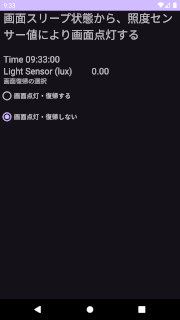

## 画面スリープから復帰する方法のメモ<!-- omit in toc -->

---
[Home](https://oasis3855.github.io/webpage/) > [Software](https://oasis3855.github.io/webpage/software/index.html) > [ソフトウエア開発・PC管理のメモ帳](https://oasis3855.github.io/webpage/software/software_server_memo.html) > [Workspace_Android](../README.md)  > ***Wakeup_From_Sleep*** (this page)

<br />
<br />

Last Updated : 2024/12/19

目次

- [概要](#概要)
- [DisplayWakeupTest01](#displaywakeuptest01)
  - [画面スリープからの復帰](#画面スリープからの復帰)


<br />
<br />

## 概要

画面スリープ状態から、照度センサー値に応じスリープ解除し画面点灯する方法のメモ


## DisplayWakeupTest01

- 主な機能
  - スレッドを用いて、1秒毎に画面情報表示＆ログ出力（現在時刻、照度センサー値 ほか）
  - 画面スリープ状態の時、指定した照度以上を検知すると画面スリープ解除する
  - ※ API 17 (Android 4.2) 以降で非推奨（deprecated）となったPowerManager.FULL_WAKE_LOCK を使う方法

- 主なソースコードを直接参照する
  - [MainActivity.java](./DisplayWakeupTest01/app/src/main/java/com/example/displaywakeuptest01/MainActivity.java)
  - [activity_main.xml](./DisplayWakeupTest01/app/src/main/res/layout/activity_main.xml)
  - [AndroidManifest.xml](./DisplayWakeupTest01/app/src/main/AndroidManifest.xml)




### 画面スリープからの復帰

```java
private PowerManager.WakeLock wakeLock = null;

if (wakeLock != null && wakeLock.isHeld()) {
    wakeLock.release();
}
wakeLock = null;
wakeLock = powerManager.newWakeLock(PowerManager.FULL_WAKE_LOCK | PowerManager.ACQUIRE_CAUSES_WAKEUP | PowerManager.ON_AFTER_RELEASE, "MyApp::MyWakelockTag");
// 10秒 画面ON
wakeLock.acquire(10 * 1000L);
```

次のような権限設定を```app/src/main/AndroidManifest.xml```に記述する。

```xml
<uses-permission android:name="android.permission.WAKE_LOCK"/>
```
